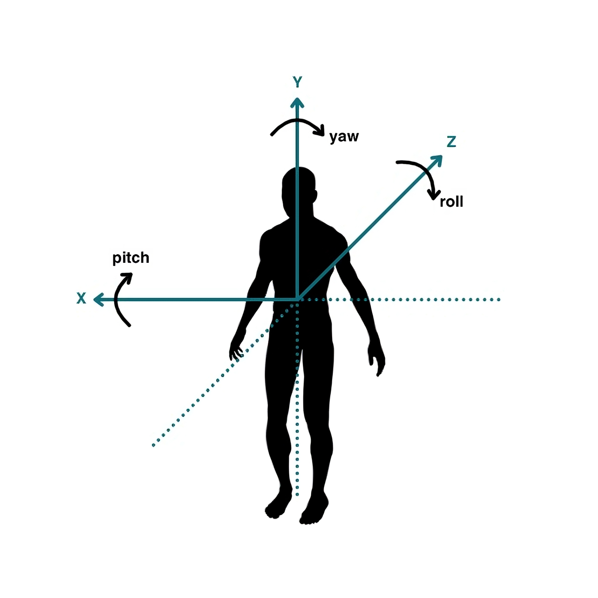
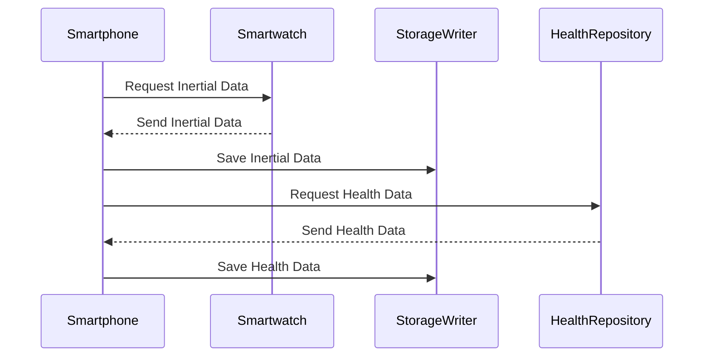
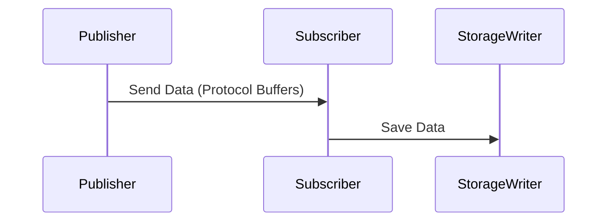

# 0. introduction

## 0.1 purpose
This document outlines the data collection, transmission, storage, and processing protocols for the OmniWear platform. The aim is to provide a comprehensive overview of how user data is managed, ensuring compliance with GDPR and other data privacy regulations. This protocol will serve as supplementary material for a national cascade call application and form the basis for applying for a patent with the OmniWear software.

## 0.2 scope
The protocol described herein applies to the OmniWear application installed on smartphones and smartwatches. It is designed to support both centralized and edge data collection and processing. This flexibility allows organizations to tailor data handling to their specific needs, whether for centralized analysis or privacy-preserving edge processing.

# 1. ToC

- [0. introduction](#0-introduction)
  - [0.1 purpose](#01-purpose)
  - [0.2 scope](#02-scope)
- [1. ToC](#1-toc)
- [2. Overview of the Protocol](#2-overview-of-the-protocol)
  - [2.1 Description](#21-description)
  - [2.2 Philosophy and Pillars](#22-philosophy-and-pillars)
  - [2.3 Use Cases](#23-use-cases)
  - [2.4 Benefits](#24-benefits)
- [3. Data Collection Methodology](#3-data-collection-methodology)
  - [3.1 Types of Data Collected](#31-types-of-data-collected)
    - [3.1.1 Physical Traits](#311-physical-traits)
    - [3.1.2 Device Attributes](#312-device-attributes)
    - [3.1.3 Inertial Time-Series](#313-inertial-time-series)
    - [3.1.4 Health Time-Series](#314-health-time-series)
  - [3.2 Data Acquisition](#32-data-acquisition)
    - [3.2.1 Physical Traits](#321-physical-traits)
    - [3.2.2 Device Attributes](#322-device-attributes)
    - [3.2.3 Inertial Data Collection](#323-inertial-data-collection)
    - [3.2.4 Health Data Collection](#324-health-data-collection)
    - [3.2.5 Database Config Collection](#325-database-config-collection)
  - [3.3 Data Acquisition Diagrams](#33-data-acquisition-diagrams)
- [4. Data Transmission](#4-data-transmission)
  - [4.1 Connectivity](#41-connectivity)
  - [4.2 Data Synchronization](#42-data-synchronization)
  - [4.3 Data Transmission Protocols](#43-data-transmission-protocols)
  - [4.4 Publisher and Subscriber Interaction](#44-publisher-and-subscriber-interaction)
  - [4.5 Data Transmission Diagrams](#45-data-transmission-diagrams)
- [5. Data Storage](#5-data-storage)
  - [5.1 Local On-Device Storage](#51-local-on-device-storage)
  - [5.2 Remote SQL Database Storage](#52-remote-sql-database-storage)
  - [5.3 Database Schema](#53-database-schema)
    - [5.3.1 Participants Table](#531-participants-table)
    - [5.3.2 Datasets Table](#532-datasets-table)
    - [5.3.3 Sessions Table](#533-sessions-table)
    - [5.3.4 TS-Inertial Table](#534-ts-inertial-table)
    - [5.3.5 TS-Inertial-ETL Table (deprecated)](#535-ts-inertial-etl-table-deprecated)
    - [5.3.6 TS-Health Table](#536-ts-health-table)
    - [5.3.7 features coding config](#537-features-coding-config)
- [6. Data Processing and Aggregation](#6-data-processing-and-aggregation)
  - [6.1 Inertial Data Aggregation](#61-inertial-data-aggregation)
  - [6.2 Health Data Aggregation](#62-health-data-aggregation)
  - [6.3 ETL Pipeline](#63-etl-pipeline)
- [7. GDPR Compliance and Data Privacy](#7-gdpr-compliance-and-data-privacy)
  - [7.1 Overview of GDPR Requirements](#71-overview-of-gdpr-requirements)
  - [7.2 Data Anonymization](#72-data-anonymization)
  - [7.3 User Consent](#73-user-consent)
  - [7.4 Data Security Measures](#74-data-security-measures)
  - [7.5 Rights of Data Subjects](#75-rights-of-data-subjects)
- [8. References](#8-references)
- [Appendix A](#appendix-a)
  - [A.1 Acronyms and Abbreviations](#a1-acronyms-and-abbreviations)
  - [A.2 Example Scenario and Load Analysis](#a2-example-scenario-and-load-analysis)
    - [A.2.1 Example Session Config](#a21-example-session-config)
    - [A.2.2 Data Transmission Load](#a22-data-transmission-load)
    - [A.2.3 Data Storage Load](#a23-data-storage-load)

# 2. Overview of the Protocol

## 2.1 Description
The OmniWear protocol facilitates the collection and analysis of biometric and inertial data from users through their smartphones and smartwatches. By leveraging the sensors available on these devices, OmniWear aims to develop non-invasive prevention tools for monitoring and analyzing user data. This protocol ensures data is collected efficiently and securely, providing valuable insights into health and physical activity.

## 2.2 Philosophy and Pillars
The OmniWear platform is built on several key pillars and guiding philosophies that ensure its robustness, flexibility, and widespread adoption:

- **Configurability**: The OmniWear protocol is fully configurable, allowing users to customize the way data is collected, processed, and stored based on their specific needs. This includes adjustable frequencies, intervals, and data aggregation windows, ensuring that the platform can cater to a variety of use cases from different industries.

- **Cross-Platform Compatibility**: Designed natively for both iOS and Android devices, OmniWear ensures widespread adoption and usability. By supporting a wide range of smartphones and smartwatches, the platform can be seamlessly integrated into the existing technological ecosystems of users.

- **Data Privacy and Security**: OmniWear prioritizes user privacy and data security. By complying with GDPR and other relevant regulations, the platform ensures that all collected data is handled with the utmost care. This includes anonymizing and de-identifying participant information to protect user identity.

- **Scalability and Flexibility**: The protocol supports both centralized and edge processing of data. This flexibility allows organizations to choose a data handling approach that best suits their needs, whether for unified data analysis or enhanced privacy through federated learning and edge processing.

## 2.3 Use Cases
The protocol supports various use cases, including but not limited to:
- **Health and Fitness Tracking**: Providing users with real-time feedback on their physical activity and health metrics.
- **Clinical Research and Trials**: Enabling researchers to collect and analyze data from study participants in a standardized manner.
- **Personalized Health Insights**: Offering tailored health recommendations based on individual user data.
- **Fall Detection and Prevention**: Utilizing inertial data to detect falls and alert emergency contacts.

## 2.4 Benefits
Implementing the OmniWear protocol offers several benefits:
- **Comprehensive Data Collection**: Collecting data from multiple sources ensures a holistic view of user health and activity.
- **Flexible Data Storage Options**: Accommodating different organizational needs, from centralized databases to edge processing.
- **Enhanced Data Privacy and Security**: Ensuring compliance with regulations such as GDPR.
- **Support for Federated Learning**: Enabling collaborative model training without compromising user privacy.

# 3. Data Collection Methodology

## 3.1 Types of Data Collected
The OmniWear protocol collects various types of data to provide comprehensive insights into user health and activity.

### 3.1.1 Physical Traits
- **Gender**: Used for demographic analysis and personalized insights.
- **Birth Date**: Helps in age-related health analysis and personalization.

### 3.1.2 Device Attributes
- **Smartphone Model**: Information about the user's smartphone model.
- **Smartphone OS Version**: Operating system version of the user's smartphone.
- **Smartwatch Model**: Information about the user's smartwatch model.
- **Smartwatch OS Version**: Operating system version of the user's smartwatch.

### 3.1.3 Inertial Time-Series
- **Timestamp**: The time at which the data was recorded.
- **Smartphone Accelerometer**: Gravity-corrected acceleration data along the X, Y, and Z axes.
- **Smartphone Gyroscope**: Angular velocity data along the X, Y, and Z axes.
- **Smartphone Magnetometer**: Ambient magnetic field in microteslas along the X, Y, and Z axes.
- **Smartphone Barometer**: Surrounding atmospheric pressure in hectopascals.
- **Smartwatch Accelerometer**: Gravity-corrected acceleration data along the X, Y, and Z axes.
- **Smartwatch Gyroscope**: Angular velocity data along the X, Y, and Z axes.
- **Smartwatch Magnetometer**: Ambient magnetic field in microteslas along the X, Y, and Z axes.
- **Smartwatch Barometer**: Surrounding atmospheric pressure in hectopascals.

### 3.1.4 Health Time-Series
- **Active Energy Burned** (calories): Energy expended during physical activity.
- **Basal Energy Burned** (calories): Energy expended at rest.
- **Blood Glucose** (mg/dL): Blood sugar levels.
- **Blood Oxygen** (percentage): Oxygen saturation in the blood.
- **Blood Pressure Diastolic** (mmHg): Diastolic blood pressure.
- **Blood Pressure Systolic** (mmHg): Systolic blood pressure.
- **Body Fat Percentage** (percentage): Proportion of body fat.
- **Body Mass Index** (BMI): Body mass index.
- **Body Temperature** (°C): Body temperature.
- **Heart Rate** (bpm): Heartbeats per minute.
- **Height** (meters): User's height.
- **Resting Heart Rate** (bpm): Heart rate at rest.
- **Respiratory Rate** (respirations per minute): Breaths per minute.
- **Steps** (count): Number of steps taken.
- **Weight** (kg): User's weight.
- **Sleep Asleep** (minutes): Duration of sleep.
- **Sleep Awake** (minutes): Duration of wakefulness during sleep period.
- **Water** (liters): Water intake.
- **Workout** (boolean): Whether the user performed a workout.

## 3.2 Data Acquisition
The data collection methodology is divided into several components to ensure comprehensive and accurate data gathering.

### 3.2.1 Physical Traits
Physical traits are derived from the Identity Provider (IDP) if available. Future versions of the protocol may ask users directly for this information if not provided by the IDP.

### 3.2.2 Device Attributes
Device attributes are obtained using the [device_info_plus](https://pub.dev/packages/device_info_plus) Flutter package, which provides detailed information about the user's smartphone and smartwatch.

### 3.2.3 Inertial Data Collection
Inertial data is collected using the [sensors_plus](https://pub.dev/packages/sensors_plus) package. The smartphone reads its own sensor data and that of the smartwatch at specified intervals, synchronizing the streams for accurate analysis.

inertial data will respect the following right-handed coordinate system:

### 3.2.4 Health Data Collection
Health data is collected using the [health](https://pub.dev/packages/health) package, which queries health repositories such as Apple Health and Google Health Connect at specified intervals. This allows for the integration of health data from various sources into a unified dataset.

### 3.2.5 Database Config Collection
The database configuration defines the parameters for data collection, including frequencies, intervals, and the specific inertial and health features to be tracked. This configuration ensures that data is collected in a consistent and structured manner.

## 3.3 Data Acquisition Diagrams

# 4. Data Transmission
## 4.1 Connectivity
The protocol ensures continuous connectivity between publishers (smartwatch) and subscribers (smartphone) via Bluetooth Low Energy (BLE). This connectivity is crucial for the real-time transmission of inertial data.

## 4.2 Data Synchronization
The subscriber on the smartphone side synchronizes and reads inertial data from its own sensors and the smartwatch's sensors at specified intervals. This synchronized data is then published to the storage writer for further processing.

## 4.3 Data Transmission Protocols
The protocol uses Protocol Buffers for efficient and structured data transmission. Protocol Buffers are a method developed by Google for serializing structured data, which ensures that data transmission is both fast and reliable.

## 4.4 Publisher and Subscriber Interaction
Publishers (smartwatches) send data to subscribers (smartphones), which then forward the data to the storage writer. This interaction is managed by the OmniWear package, ensuring data integrity and synchronization.

## 4.5 Data Transmission Diagrams

# 5. Data Storage
## 5.1 Local On-Device Storage
Data is initially stored in an SQLite database on the device. This ensures that data is available for immediate processing and analysis, even without an internet connection.

## 5.2 Remote SQL Database Storage
For centralized data collection, data is also stored in a predefined SQL database (e.g., Firebase) via a valid connection string. The OmniWear package ensures that database migrations happen successfully to the remote database, if none exists with the desired schema.

## 5.3 Database Schema
The database schema is designed to store the collected data in a structured and efficient manner. The following tables are used:

### 5.3.1 Participants Table
| Column | Type  |    Description    |
| :----: | :---: | :---------------: |
|   ID   |  int  | PK,auto-increment |

### 5.3.2 Datasets Table
|            Column             |  Type  |     Description      | Example |
| :---------------------------: | :----: |:------------------: | :--:|
|              ID               |  int   | PK  , auto-increment ||
|          Start Date           |  date  || 2024-07-01
|           End Date            |  date  || 2024-09-30
| Inertial Collection Frequency | float  |Hz| 30
|    Inertial Sleep Interval    | float  |seconds| 600
| Inertial Collection Duration  | float  |seconds| 60
|  Inertial Aggregation Window  | float  |seconds| 10
|  Inertial Features  | string  | Comma-separated|acceloremeter,barometer
|   Health Reading Frequency    | float  |seconds| 1800
|    Health Reading Interval    | float  |seconds| 1800
|        Health Features        | string |  Comma-separated    |active-energy-burned,heart-rate

### 5.3.3 Sessions Table
|        Column         |   Type    |    Description     | Example|
| :-------------------: | :-------: | :----------------: |:--:|
|          ID           |    int    | PK ,auto-increment |
|      Database ID      |    int    |         FK         |
|    Participant ID     |    int    |         FK         |
|    Start Timestamp    | timestamp || 2024-07-10 09:00:00
|     End Timestamp     | timestamp || 2024-07-10 18:00:00
|   Smartphone Model    |  varchar  || iPhone 16
| Smartphone OS Version |  varchar  || iOS 17.0
|   Smartwatch Model    |  varchar  || Apple Watch Ultra 2
| Smartwatch OS Version |  varchar  || watchOS 10.0

### 5.3.4 TS-Inertial Table
|       Column       |   Type    |     Description     |
| :----------------: | :-------: | :-----------------: |
|         ID         |    int    | PK ; auto-increment |
|     Session ID     |    int    |     FK     |
|     Timestamp      | timestamp |
| Smartphone Accelerometer X |   float   |
| Smartphone Accelerometer Y |   float   |
| Smartphone Accelerometer Z |   float   |
| Smartphone Gyroscope X  |   float   |
| Smartphone Gyroscope Y  |   float   |
| Smartphone Gyroscope Z  |   float   |
| Smartphone Magnometer X  |   float   |
| Smartphone Magnometer Y  |   float   |
| Smartphone Magnometer Z  |   float   |
| Smartphone Barometer  |   float   |
| Smartwatch Accelerometer X |   float   |
| Smartwatch Accelerometer Y |   float   |
| Smartwatch Accelerometer Z |   float   |
| Smartwatch Gyroscope X  |   float   |
| Smartwatch Gyroscope Y  |   float   |
| Smartwatch Gyroscope Z  |   float   |
| Smartwatch Magnometer X  |   float   |
| Smartwatch Magnometer Y  |   float   |
| Smartwatch Magnometer Z  |   float   |
| Smartwatch Barometer  |   float   |

### 5.3.5 TS-Inertial-ETL Table (deprecated)

if a non-zero inertial aggregation window was provided in the config, the raw inertial data will be aggregated into the following table: any movement feature should be intended on the Z-axis.

|                   Column                   | Type  | Description |
| :----------------------------------------: | :---: | :---------: |
|                     ID                     |  int  |     PK      |
|                 Session ID                 |  int  | FK |
|                 Timestamp                  | float |
|          Smartphone Sway Area XY           | float |
|          Smartphone Sway Area XZ           | float |
|          Smartphone Sway Area YZ           | float |
|           Smartphone Sway Volume           | float |
|            Smartphone Z Cadence            | float |
|        Smartphone Z Frequency Ratio        | float |
|     Smartphone Z Residual Step Length      | float |
|          Smartphone Z Band Power           | float |
|              Smartphone Z SNR              | float |
|           Smartphone Z Skewness            | float |
|           Smartphone Z Kurtosis            | float |
|   Smartphone Z Total Harmonic Distortion   | float |
|          Smartwatch Sway Area XY           | float |
|          Smartwatch Sway Area YZ           | float |
|          Smartwatch Sway Area XZ           | float |
|           Smartwatch Sway Volume           | float |
|          Smartwatch Z Band Power           | float |
|              Smartwatch Z SNR              | float |
|         Smartphone X Velocity Mean         | float |
|         Smartphone Y Velocity Mean         | float |
|         Smartphone Z Velocity Mean         | float |
|       Smartphone X Velocity Variance       | float |
|       Smartphone Y Velocity Variance       | float |
|       Smartphone Z Velocity Variance       | float |
|    Smartwatch Angular Velocity Yaw Mean    | float |
|  Smartwatch Angular Velocity Yaw Variance  | float |
|   Smartwatch Angular Velocity Pitch Mean   | float |
| Smartwatch Angular Velocity Pitch Variance | float |
|   Smartwatch Angular Velocity Roll Mean    | float |
| Smartwatch Angular Velocity Roll Variance  | float |
|         Smartwatch X Velocity Mean         | float |
|         Smartwatch Y Velocity Mean         | float |
|         Smartwatch Z Velocity Mean         | float |
|       Smartwatch X Velocity Variance       | float |
|       Smartwatch Y Velocity Variance       | float |
|       Smartwatch Z Velocity Variance       | float |

### 5.3.6 TS-Health Table
|     Column      |       Type        | Description | Example|
| :-------------: | :---------------: | :---------: | :---: |
|       ID        |        int        |     PK      |
|   Session ID    |        int        | FK |
| Start Timestamp |     timestamp     || 2024-07-10 09:30:00
|  End Timestamp  |     timestamp     || 2024-07-10 09:35:00
|    Category     |      varchar      || steps
|       Unit      |       varchar        || count
|      Value      | float/int/varchar || 500

### 5.3.7 features coding config

health and inertial features in the [Datasets Table](#532-datasets-table) follow a specific coding config logic that gives users the desired flexibility to select which features to track in the dataset:
- empty string ("") or null mean that modality is disabled and should not be collected;
- a star "*" means all features of that modality should be collected;
- a comma-separated string (e.g., "accelerometer,gyroscope" for inertial features, "STEPS,ACTIVE_ENERGY_BURNED" for health features) means that modality is enabled, but only the specified features should be collected, while the rest ignored.

The chosen features config will reflect in the TS-* tables schema.

# 6. Data Processing and Aggregation

## 6.1 Inertial Data Aggregation
Inertial data aggregation involves transforming raw inertial data into higher-order features over specified windows. This process enhances the data's utility for various analytical purposes, including machine learning models and health insights.

## 6.2 Health Data Aggregation
Health data is aggregated by querying health repositories at specified intervals. This aggregation allows for the integration of diverse health metrics into a cohesive dataset, facilitating comprehensive health analysis.

## 6.3 ETL Pipeline
The ETL (Extract, Transform, Load) pipeline is a critical component of the OmniWear protocol. It ensures that data is efficiently transformed into structured formats for analysis. The pipeline includes data extraction from devices, transformation into structured formats, and loading into databases for storage and analysis.

# 7. GDPR Compliance and Data Privacy
## 7.1 Overview of GDPR Requirements
The General Data Protection Regulation (GDPR) sets stringent requirements for data privacy and protection. The OmniWear protocol ensures compliance with GDPR by implementing robust data privacy measures, user consent mechanisms, and data security protocols.

## 7.2 Data Anonymization
Data is de-identified by design, ensuring that no personal identifiers are stored. This approach protects user privacy while allowing for valuable health and activity insights.

## 7.3 User Consent
Explicit user consent is obtained for data collection and processing. Users are informed about the types of data collected, the purposes of collection, and their rights regarding data access, correction, and deletion.

## 7.4 Data Security Measures
Data is encrypted during transmission and storage, ensuring that it remains secure and protected from unauthorized access. Regular audits are conducted to ensure that data security measures are effective and up-to-date.

## 7.5 Rights of Data Subjects
Users have the right to access their data, request corrections, and request deletions in accordance with GDPR regulations. These rights are communicated to users, and mechanisms are in place to facilitate these requests.

# 8. References
A. McAfee, J. Watson, B. Bianchi, C. Aiello, and E. Agu, "AlcoWear: Detecting blood alcohol levels from wearables," 2017 IEEE SmartWorld, Ubiquitous Intelligence & Computing, Advanced & Trusted Computing, Scalable Computing & Communications, Cloud & Big Data Computing, Internet of People and Smart City Innovation (SmartWorld/SCALCOM/UIC/ATC/CBDCom/IOP/SCI), San Francisco, CA, USA, 2017, pp. 1-8, doi: 10.1109/UIC-ATC.2017.8397486.

# Appendix A
## A.1 Acronyms and Abbreviations
- BLE: Bluetooth Low Energy
- GDPR: General Data Protection Regulation
- ETL: Extract, Transform, Load
- IDP: Identity Provider
- OS: Operating System

## A.2 Example Scenario and Load Analysis

### A.2.1 Example Session Config
- Inertial Collection Frequency: 1 second
- Inertial Sleep Interval: 30 seconds
- Inertial Collection Duration: 10 seconds
- Health Reading Frequency: 60 seconds
- Health Reading Interval: 60 seconds
- Health Features: [Heart Rate, Steps, Sleep Asleep, Sleep Awake]

### A.2.2 Data Transmission Load
- Inertial Data: Approximately 1 KB per second
- Health Data: Approximately 0.5 KB per minute

### A.2.3 Data Storage Load
- Inertial Data: Approximately 86.4 MB per day per user
- Health Data: Approximately 7.2 MB per day per user
